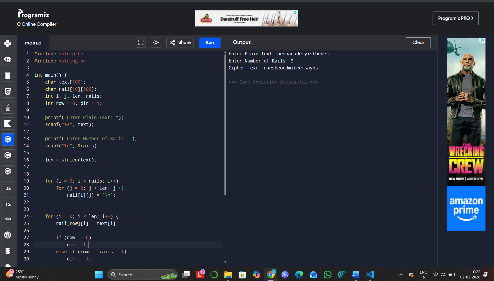

# Ex-4 Rail-Fence-Program

# IMPLEMENTATION OF RAIL FENCE – ROW & COLUMN TRANSFORMATION TECHNIQUE

# AIM:

To write a C program to implement the rail fence transposition technique.

# DESCRIPTION:

In the rail fence cipher, the plain text is written downwards and diagonally on successive "rails" of an imaginary fence, then moving up when we reach the bottom rail. When we reach the top rail, the message is written downwards again until the whole plaintext is written out. The message is then read off in rows.

# ALGORITHM:

STEP-1: Read the Plain text.

STEP-2: Arrange the plain text in row columnar matrix format.

STEP-3: Now read the keyword depending on the number of columns of the plain text.

STEP-4: Arrange the characters of the keyword in sorted order and the corresponding columns of the plain text.

STEP-5: Read the characters row wise or column wise in the former order to get the cipher text.

# PROGRAM:
```
#include <stdio.h>
#include <string.h>

int main () {
    char text [100];
    char rail [10][100];
    int i, j, len, rails;
    int row = 0, dir = 1;

    printf ("Enter Plain Text: ");
    scanf ("%s", text);

    printf ("Enter Number of Rails: ");
    scanf ("%d", &rails);

    len = strlen(text);

    
    for (i = 0; i < rails; i++)
        for (j = 0; j < len; j++)
            rail[i][j] = '\n';

    
    for (i = 0; i < len; i++) {
        rail[row][i] = text[i];

        if (row == 0)
            dir = 1;
        else if (row == rails - 1)
            dir = -1;

        row += dir;
    }

    
    printf ("Cipher Text: ");
    for (i = 0; i < rails; i++)
        for (j = 0; j < len; j++)
            if (rail[i][j]! = '\n')
                printf ("%c", rail[i][j]);

    return 0;
}

```

# OUTPUT:


# RESULT:
Thus, the C program to implement the rail fence transposition technique was completed and successfully executed.
